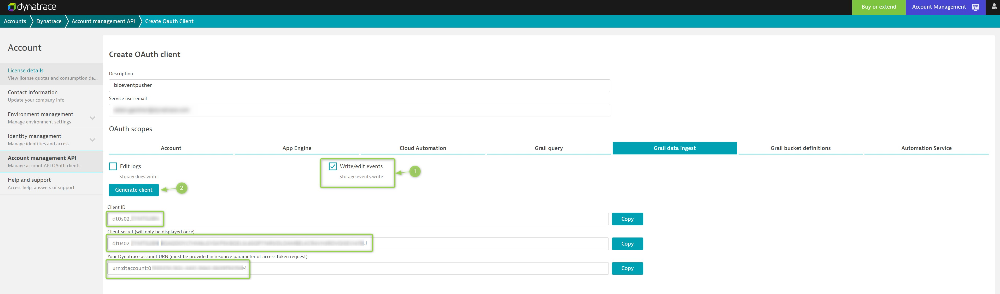

# BizEvent Pusher

A tool to assist pushing Business Events (aka bizevents) to the Dynatrace platform.

## Prereq: Create OAuth Client

1. Go to the [Dynatrace account management API page](https://account.dynatrace.com/my/enterprise-api)
2. Click "Create New Client"
3. Provide a descriptive name and use your email as the service user ID
4. Uncheck all **Account** permissions
5. Switch to **Grail data ingest** tab and check **Write/edit events (storage:events:write)**
6. Double check that the **only** box you have checked in the **storage:events:write** box
7. Click **Generate new client**
8. Make a note of the 3 values provided (client ID, client secret and URN). These are sensitive. Do not store in Git.



## Use It

- Tenant must be WITHOUT trailing slash.
- `-ocid` = Client ID generated above
- `-ocs` = Client secret generated above
- `-urn` = URN generated above

```
docker run --rm gardnera/bizeventpusher:0.1.0 \
-ten https://abc12345.live.dynatrace.com \
-ocid dt0s02.***** \
-ocs dt0s02.*****.**************** \
-urn urn:dtaccount:******** \
-p '{"foo": "bar"}'
```

Successful output should result in:

```
Bizevent successfully sent!
```

## Retrieving Business Events
In the platform, run `fetch bizevents`.

## Sample GitHub Action Workflow
This container can be used as part of a GitHub Action workflow. For example, to push a bizevent anytime an issue is `opened`, `edited` or `closed`.

Of course, first you need to create GitHub Action secrets to hold your details.

```
TODO...
```

Then:

```
fetch bizevents
| filter isNotNull(type)
| filter type == "issues.edited"
```

## Clone and Build

Optional, but if you want to clone this repo and build a custom version:

```
git clone https://github.com/agardnerit/bizeventpusher.git
cd bizeventpusher
docker build -t YOU/bizeventpusher:0.1.1 code/.
```